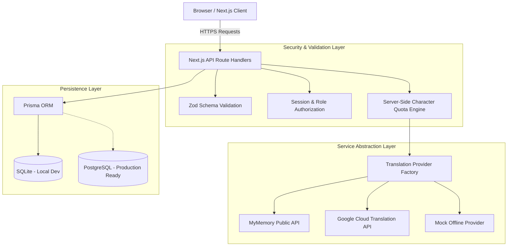
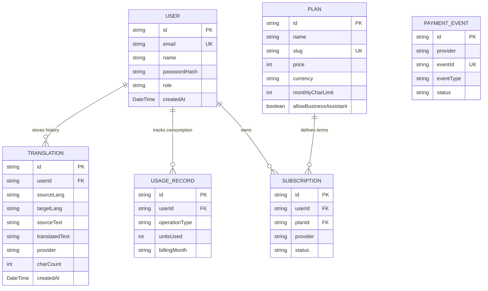

# System Architecture & Technical Specifications: BhashaSetu

## 1. Architectural Philosophy

BhashaSetu is architected using **Modular Monolith principles** with Next.js 14 App Router. It separates client-side presentation components from backend business logic and external provider integrations.



---

## 2. Component Design & Patterns

### 2.1 Provider Pattern (`ITranslationProvider`)
To decouple translation business logic from third-party vendor APIs, all translation engines implement a common contract:

```typescript
export interface ITranslationProvider {
  readonly name: string;
  translate(text: string, sourceLang: string, targetLang: string): Promise<TranslationResult>;
  getSupportedLanguages(): Language[];
}
```

This guarantees:
1. Zero vendor lock-in.
2. Rapid fallback when an external API experiences an outage.
3. Easy addition of future vendors (e.g. DeepL, AWS Translate, Azure Translator).

### 2.2 Payment & Webhook Idempotency Pattern
When payment providers trigger webhooks upon successful subscription payments, network retries can send duplicate webhook notifications.

To prevent double-crediting or race conditions, BhashaSetu utilizes the **Idempotency Key Pattern** via the `PaymentEvent` table:
1. Webhook receives event payload with unique `eventId`.
2. Checks `PaymentEvent.findUnique({ where: { eventId } })`.
3. If already present, responds with HTTP `200 OK` and skips redundant execution.
4. If novel, logs the event and atomically updates the user's subscription entitlement.

---

## 3. Database Entity Relationship Diagram (ERD)



---

## 4. Security Architecture

1. **Zero Secret Leaks:** No API keys, database credentials, or secret tokens are bundled in client-side code.
2. **HTTP-Only Cookies:** Auth session tokens are stored exclusively in HTTP-only, SameSite lax cookies, eliminating XSS token theft.
3. **Zod Runtime Type Safety:** All incoming request bodies are checked against strict schemas to block SQL/NoSQL injection and unexpected types.
4. **Sliding-Window Monthly Quotas:** Quotas are calculated dynamically on the server based on `UsageRecord` rows for the active billing month `YYYY-MM`.
