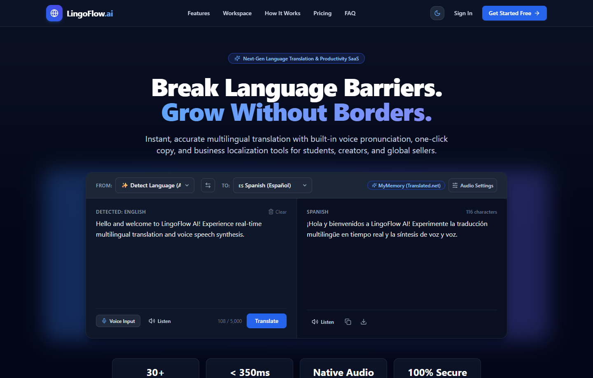
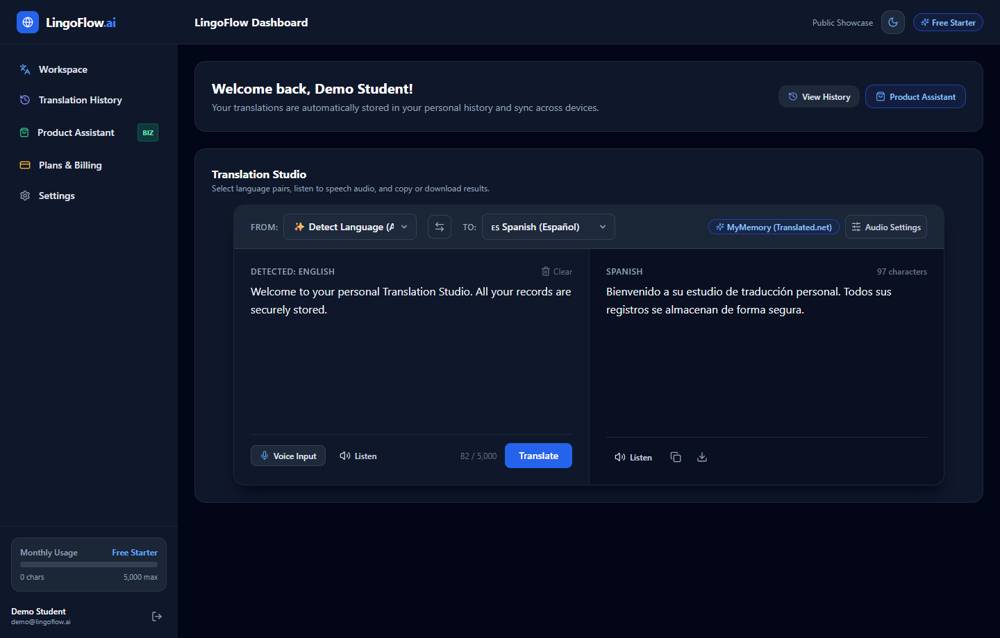
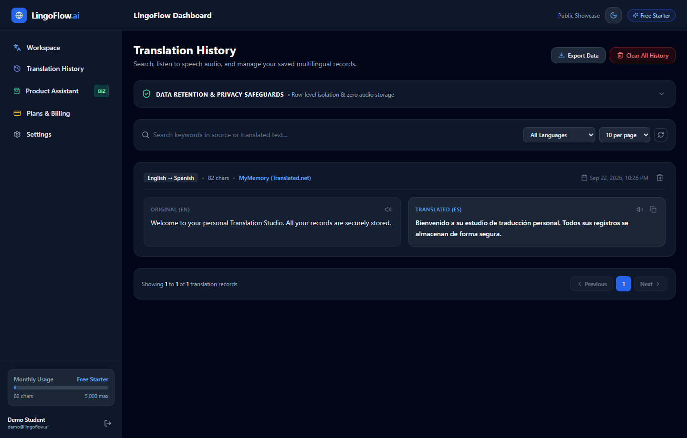
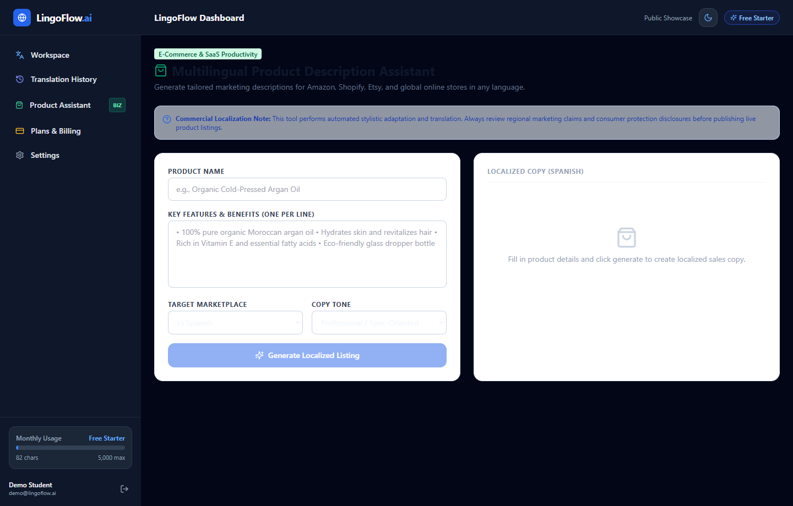
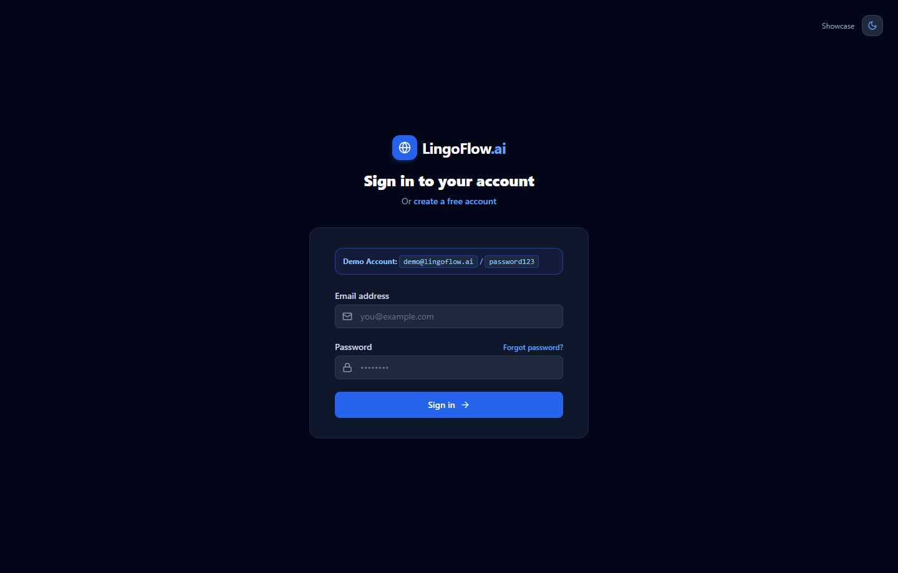

# BhashaSetu — Language Translation Tool 🌐
### *"Connecting Languages, Empowering Communication."*

[](https://nextjs.org/)
[](https://www.typescriptlang.org/)
[](https://tailwindcss.com/)
[](https://www.prisma.io/)
[](https://www.sqlite.org/)
[](LICENSE)

**BhashaSetu** is an industry-ready, production-grade **Language Translation, Localization, and SaaS Productivity Platform** built from scratch for the **CodeAlpha Full-Stack Web Development Internship (Task 1)**.

---

## 📸 Screenshots Showcase

### 1. Interactive Translation Studio (CodeAlpha Task 1 Workspace)
*Live translation across 30+ languages, auto-detection, Speech-to-Text input, Text-to-Speech playback, AI Tone Selection, one-click copy, and export.*



---

### 2. User Dashboard & Translation Studio
*Authenticated user dashboard featuring monthly quota tracking, quick actions, and private workspace.*



---

### 3. Translation History & Record Management
*Server-side paginated translation history with real-time keyword search, language filtering, audio replay, and CSV/TXT export.*



---

### 4. Multilingual E-Commerce Business Assistant
*Specialized SaaS localization assistant generating tailored marketing copy for global marketplaces (Amazon, Shopify, Etsy).*



---

### 5. Secure Authentication & Demo Login
*Enterprise-grade security featuring bcrypt password hashing, encrypted JWT session tokens, and instant demo access.*



---

## 🌟 Key Features

### 1. Core Translation Workspace (CodeAlpha Task 1 Requirements)
- 🌐 **Live Multilingual Translation:** High-speed translation across 30+ major world languages (English, Spanish, French, German, Hindi, Japanese, Chinese, Arabic, and more) with automatic source language detection.
- 🎙️ **Voice-to-Text (STT) Speech Recognition:** Live speech input via native Web Speech API with real-time interim transcription and audio level feedback.
- 🔊 **Text-to-Speech (TTS) Voice Synthesis:** Instant pronunciation playback with voice accent selection, pitch, and speed adjustments.
- 📋 **Productivity Shortcuts:** One-click clipboard copy with visual feedback, text clearing, instant language swapping, and `.txt` export.
- 🛡️ **Server-Side API Security:** Secure Next.js backend Route Handlers with Zod validation protecting translation keys and third-party endpoints.
- 📊 **Character Counting & Length Enforcement:** Live counter enforcing up to 5,000 characters per translation request.

### 2. Full-Stack SaaS Architecture & Productivity Tools
- 📦 **Multilingual Product Description Assistant:** Converts product names and bullet points into high-converting e-commerce listings tailored by tone (Professional, Creative, Technical, Persuasive).
- 🔐 **Authentication & Session Security:** Complete sign-up, sign-in, and password reset flows with bcrypt password hashing and tamper-proof HTTP-only JWT sessions.
- 📜 **Personal Translation History:** Automatically archives translations for authenticated users with search, pagination, single-item deletion, and bulk purging.
- 📈 **Quota & Usage Limiting:** Real-time monthly character quota tracking (Free Starter: 5,000 chars; Pro Creator: 100,000 chars).
- 💳 **Payment Gateway Architecture:** Dual-gateway design supporting **Razorpay** (India UPI/Cards) and **Stripe** (International currencies) with idempotent webhook processing.
- 🌓 **Zero-FOUC Dark / Light Theme:** Custom theme switcher with persistent preferences stored in `localStorage` and system preference detection.

---

## 🛠️ Technology Stack

| Layer | Technology | Purpose |
| :--- | :--- | :--- |
| **Frontend Framework** | **Next.js 14+ (App Router)** | Server Components, Route Handlers, fast SSR & client hydration |
| **Language** | **TypeScript 5.6** | Complete type safety, zero compile errors (`tsc --noEmit`) |
| **Styling & UI** | **Tailwind CSS 3.4** | Modern, responsive dark/light mode SaaS design system |
| **Icons** | **Lucide React** | Feather-light SVG icons |
| **Database & ORM** | **Prisma ORM + SQLite** | Relational schema modeling with zero-config local storage (Postgres-ready) |
| **API Validation** | **Zod** | Strict schema validation on all incoming API request payloads |
| **Auth & Security** | **bcryptjs + Jose JWT** | Secure password hashing & Edge-compatible tamper-proof JWT cookies |
| **Voice & Audio** | **Web Speech API** | Client-side native speech recognition & text-to-speech synthesis |

---

## 🚀 Quick Start (Local Setup)

### 1. Prerequisites
- **Node.js**: v18.0.0 or higher
- **Git**

### 2. Clone the Repository
```bash
git clone https://github.com/rupampatle25/CODE_ALPHA-TASK1.git
cd CODE_ALPHA-TASK1
npm install
```

### 3. Configure Environment Variables
Copy the example environment template:
```bash
cp .env.example .env
```
Default `.env` configuration:
```ini
DATABASE_URL="file:./dev.db"
JWT_SECRET="lingoflow-local-dev-secret-key-at-least-32-chars-long!"
NEXT_PUBLIC_APP_URL="http://localhost:3000"
TRANSLATION_PROVIDER="mymemory"
```

### 4. Initialize Database & Seed Demo Data
```bash
npx prisma db push
node prisma/seed.js
```

### 5. Launch Development Server
```bash
npm run dev
```
Open **[http://localhost:3000](http://localhost:3000)** in your browser.

---

## 🧪 Automated Testing Suite

Verify the entire system end-to-end (database, bcrypt hashing, live translation engine, and webhook idempotency):

```bash
npm test
```

### Expected Output:
```text
==================================================
        BhashaSetu - Automated Test Suite        
==================================================

1. Testing bcrypt password hashing and verification... ✅ PASSED
2. Testing Database Plan querying (Free & Pro)... ✅ PASSED (2 plans loaded)
3. Testing Live Translation Engine (en -> es)... ✅ PASSED -> "Buenos días, bienvenidos a nuestra aplicación."
4. Testing Multilingual Translations (en -> fr, de)... ✅ PASSED (FR: Merci beaucoup,, DE: vielen dank)
5. Testing Webhook Idempotency Event Model... ✅ PASSED: Idempotency uniqueness verified
6. Testing Demo User credentials readiness... ✅ PASSED: Demo account verified (demo@lingoflow.ai / password123)
7. Testing Translation History CRUD, Pagination & Access Control... ✅ PASSED: CRUD, row-level isolation & deletion verified
8. Testing Session Security & Password Reset Logic... ✅ PASSED: Token verification, tamper resistance & password reset verified
9. Testing AI Tone Selection & Adaptation Engine (Formal, Casual, Professional, Simple)... ✅ PASSED: All 4 tones validated with input safeguards

==================================================
Summary: 9 Passed, 0 Failed
==================================================
```

---

## 🔑 Pre-Seeded Demo Account

Use these credentials for immediate testing or presentations:
- **Email:** `demo@lingoflow.ai`
- **Password:** `password123`
- **Dashboard URL:** `http://localhost:3000/dashboard`

---

## 📁 Project Architecture & Directory Structure

```text
CODE_ALPHA-TASK1/
├── docs/
│   └── screenshots/              # High-resolution screenshots of each view
│       ├── workspace_hero.png    # Live Translation Studio
│       ├── dashboard.png         # User Dashboard
│       ├── history.png           # Translation History
│       ├── business_assistant.png# E-commerce Assistant
│       └── login.png             # Authentication
├── prisma/
│   ├── schema.prisma             # Relational schema (User, Plan, History, WebhookEvent)
│   └── seed.js                   # Database seeder for plans & demo user
├── scripts/
│   └── run-all-tests.js          # 8-suite automated end-to-end verification
├── src/
│   ├── app/
│   │   ├── (auth)/               # Login, Sign-up, Forgot Password
│   │   ├── dashboard/            # Authenticated Translation Studio, History, Assistant, Billing
│   │   ├── landing/              # Marketing & Live Interactive Workspace Showcase
│   │   ├── api/
│   │   │   ├── auth/             # Login, Signup, Logout, Reset-Password, Me
│   │   │   ├── translate/        # Core translation API route
│   │   │   ├── history/          # History CRUD with search & pagination
│   │   │   ├── business/         # Product description generator
│   │   │   ├── billing/          # Checkout session simulator
│   │   │   ├── webhooks/         # Idempotent payment webhook handler
│   │   │   └── health/           # System status endpoint
│   │   ├── globals.css           # Tailwind custom base & dark mode styles
│   │   ├── layout.tsx            # Root layout with zero-FOUC theme script
│   │   └── page.tsx              # Root router directing auth flows
│   ├── components/
│   │   ├── landing/              # Navbar, Footer
│   │   ├── theme/                # ThemeProvider & ThemeToggle
│   │   └── workspace/            # TranslationWorkspace & LanguageSelector
│   ├── lib/
│   │   ├── auth.ts               # Session token generation & password verification
│   │   ├── session.ts            # Edge-compatible jose JWT session verifier
│   │   ├── db.ts                 # Prisma Client singleton
│   │   └── utils.ts              # Helper utilities
│   ├── middleware.ts             # Route protection & auth redirection
│   └── services/
│       ├── translation/          # Provider abstraction (MyMemory, Google Cloud, Mock)
│       └── usage/                # Character quota tracking
├── ARCHITECTURE.md               # Detailed system design specification
├── SECURITY.md                   # Security guidelines & reporting
├── CONTRIBUTING.md               # Contribution workflow
└── LICENSE                       # MIT License
```

---

## 📄 License

This project is licensed under the MIT License - see the [LICENSE](LICENSE) file for details.

---

### 👨‍💻 Author
Developed for the **CodeAlpha Full-Stack Web Development Internship**.
Repository: [https://github.com/rupampatle25/CODE_ALPHA-TASK1](https://github.com/rupampatle25/CODE_ALPHA-TASK1)
